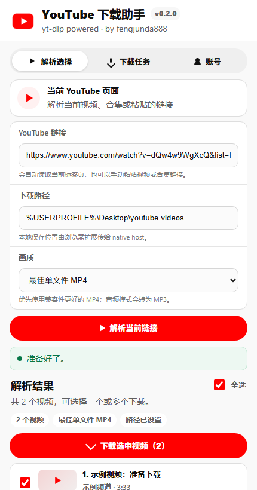
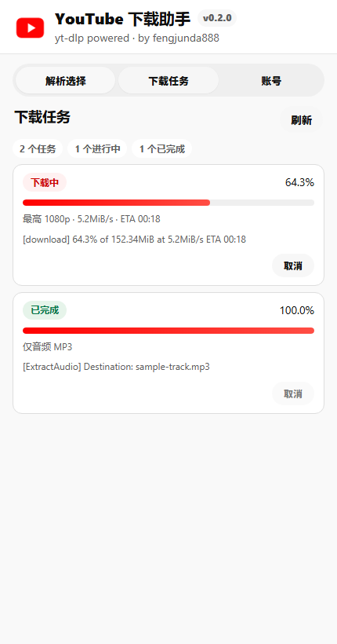

# YouTube yt-dlp Downloader

A Chrome extension for sending YouTube videos and playlists to a local `yt-dlp` native host. It supports Windows and macOS, uses Chrome Native Messaging, and does not require a long-running local web server.

中文：一个基于 `yt-dlp` 的 YouTube 视频下载 Chrome 扩展，支持 Windows 和 macOS，支持视频解析、合集解析、多选下载、全选、画质选择、下载进度显示和音频 MP3 提取。

Author: [fengjunda888](https://github.com/fengjunda888)

Keywords: YouTube download extension, YouTube video downloader, yt-dlp Chrome extension, youtube-dl, playlist downloader, 视频下载, YouTube 视频下载, 油管视频下载, YouTube 下载插件, Chrome 下载扩展.




## Features

- Resolve a YouTube video or playlist before downloading.
- Select one video, multiple videos, or all parsed videos.
- Track multiple concurrent download tasks in the popup.
- Show task status, progress, speed, ETA, and recent `yt-dlp` output.
- Choose quality presets: best single-file MP4, up to 1080p, 720p, 480p, or MP3 audio.
- Cancel running tasks.
- Store logs in a `yt-dlp-logs` folder inside the chosen download directory.

## Important limitations

This project does not bypass YouTube access controls. It can only download videos that your network, account, cookies, and `yt-dlp` are allowed to access. Members-only videos, private videos, deleted videos, region-blocked videos, or videos requiring a permission your account does not have will still fail.

Use this tool only for content you have the right to download.

## Requirements

- Windows 10 or later, or macOS
- Google Chrome or another Chromium browser that supports Native Messaging
- .NET 8 SDK, used to build the native host
- `yt-dlp` available on `PATH`, or configured with `YTDLP_PATH`

Install `yt-dlp` with Python:

```powershell
python -m pip install -U yt-dlp
```

On macOS, you can also use Homebrew:

```bash
brew install yt-dlp
```

## Chrome extension setup

1. Clone or download this repository.
2. Open Chrome and go to `chrome://extensions/`.
3. Enable `Developer mode`.
4. Click `Load unpacked`.
5. Select the `extension` folder in this repository.
6. Install the native host for your operating system.
7. Restart Chrome, then reload the extension from `chrome://extensions/`.

The extension uses a fixed development extension ID:

```text
lgdfehfacdnpknkphkfmmollklciaaal
```

## Windows native host install

Double-click:

```text
Install-NativeHost.bat
```

Or run:

```powershell
powershell -ExecutionPolicy Bypass -File .\native-host\build-host.ps1
powershell -ExecutionPolicy Bypass -File .\native-host\install-native-host.ps1
```

The installer writes the Chrome Native Messaging manifest under the current Windows user:

```text
HKCU\Software\Google\Chrome\NativeMessagingHosts\com.fengj.youtube_ytdlp
```

If `yt-dlp` is not on `PATH`, pass the executable path:

```powershell
powershell -ExecutionPolicy Bypass -File .\native-host\install-native-host.ps1 -YtDlpPath "C:\path\to\yt-dlp.exe"
```

## macOS native host install

Run:

```bash
chmod +x ./Install-NativeHost.sh ./native-host/*.sh
./Install-NativeHost.sh
```

The installer writes the Chrome Native Messaging manifest to:

```text
~/Library/Application Support/Google/Chrome/NativeMessagingHosts/com.fengj.youtube_ytdlp.json
```

If `yt-dlp` is not on `PATH`, set `YTDLP_PATH` before launching Chrome or add `yt-dlp` to your shell path.

## Usage

1. Open a YouTube video or playlist page.
2. Open the extension popup.
3. Confirm the URL and download directory.
4. Choose a quality preset.
5. Click `Resolve URL` / `解析链接`.
6. Select one or more parsed videos.
7. Click `Download selected videos` / `下载选中视频`.
8. Open the `Tasks` / `下载任务` tab to watch progress.

The default download directory is:

```text
%USERPROFILE%\Desktop\youtube videos
```

On macOS, if no directory is provided by the popup, the native host defaults to:

```text
~/Desktop/youtube videos
```

## Release packaging

Create a release zip on Windows:

```powershell
powershell -ExecutionPolicy Bypass -File .\scripts\package-release.ps1
```

The zip is written to `dist/`.

## Project layout

```text
extension/      Chrome extension UI and background script
native-host/    .NET Native Messaging host
scripts/        Release packaging scripts
docs/           Screenshots and documentation assets
```

## License

MIT
